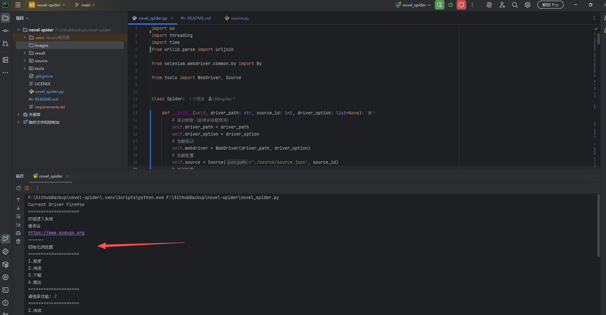
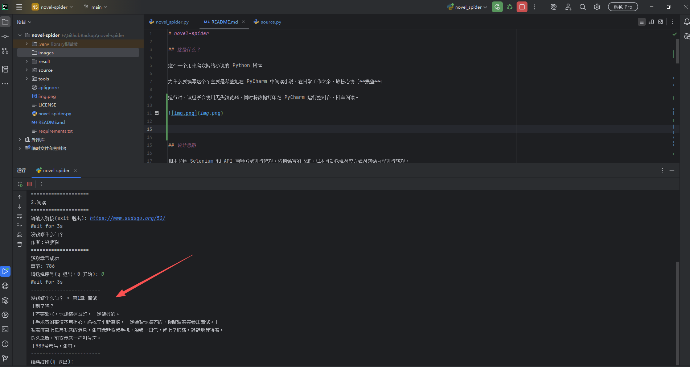
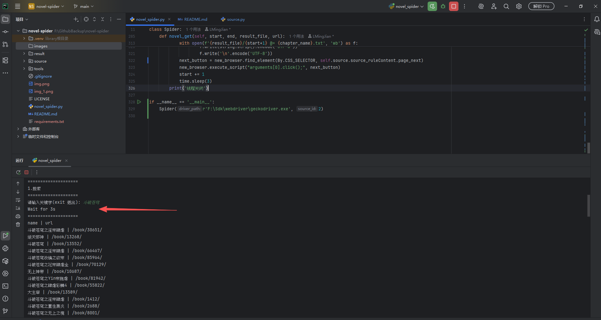

# novel-spider

## 这是什么？

这个一个用来爬取网络小说的 Python 脚本。

为什么要编写这个？主要是希望能在 PyCharm 中阅读小说，在日常工作之余，放松心情（~~摸鱼~~）。

运行时，该程序会使用无头浏览器，同时将数据打印在 PyCharm 运行控制台，回车阅读。







## 使用说明

运行文件 novel_spider.py，注意修改该文件最下面 `if __name__ == '__main__'` 语句中的 SDK 和书源 ID。

```python
if __name__ == '__main__':
    Spider(r'F:\Sdk\webdriver\geckodriver.exe', 2)
```

## 设计思路

脚本支持 Selenium 和 API 两种方式进行爬取，依据编写的书源，脚本自动选择对应方式对网站内容进行获取。

在使用 Selenium 爬取时，脚本将使用无头浏览器进行爬取，以模拟真实用户操作。（开发完毕）

- 模拟用户使用搜索框进行搜索。
- 通过链接前往书籍目录页，在书籍目录页选择章节点击。
- 在正文阅读中，模拟用户点击下一页来跳转下一章。

在使用 API 爬取时，脚本将使用 Requests 和 BeautifulSoup 进行爬取。（待开发）

## 难点问题

- 书源的适配，不同网站的界面样式不一致，如何确保脚本能通过统一的书源格式进行爬取。（这里统一使用 CSS Selector 对网站内容进行识别并爬取）
- Cloudflare 的人机验证绕过，部分网站使用 Cloudflare 的墙来避免爬虫爬取。（这里通过手动在安全的浏览器中获取 Cookie 值 `cf_clearance` 后再进行绕过）

## 书源模板

书源的编写参考了 [XIU2 / Yuedu](https://github.com/XIU2/Yuedu) 这个项目的 [书源文件](https://github.com/XIU2/Yuedu/blob/master/shuyuan) 。

需要注意的是，本项目的书源与 Yuedu 项目的书源并不通用，本项目的书源包含的信息更少（主要是麻烦）。

如果要将 Yuedu 的书源应用到本项目，则必须对书源的内容进行修改。用户需要从 Yuedu 的书源文件中查找对应页面的 CSS 选择器规则填入 `source/source.json` 这个文件夹内。

本项目会根据传入的书源格式匹配相应的控制标签，然后执行相应的爬取操作。

本项目的书源格式如下：

```json5
[
  {
    "bookSourceId": 1,  // 书源 ID，在 main.py 文件中切换来变更书源
    "bookSourceName": "搜书网",  // 网站名称
    "bookSourceGroup": "selenium",  // 爬取方式
    "bookSourceComment": "",  // 注释
    "bookSourceUrl": "https://www.soushuwang.cc",  // 网络地址
    "cloudflare": false,  // 是否存在 cloudflare 防护
    "cookie": false,  // 是否需要添加 cookie 绕过验证
    "ruleSearch": {  // 搜索栏规则
      "enable": true,  // 为 false 表示无法进行搜索，后续的内容可以不填写
      "newPage": false,  // 搜索是否会新开标签页，false 表示不会
      "inputBox": ".search .text",  // 搜索输入框规则
      "submitButton": ".search .btn",  // 搜索提交按钮规则
      "resultUrl": ".type_show .bookname a",  // 结果链接，链接必须为标签<a>，程序将取 href 和 text 值为数据
      "resultPageNext": ""  // 如果有分页，则这里写下一页按钮规则
    },
    "ruleBookInfo": {  // 书籍信息
      "name": ".info h1",  // 书籍名称
      "author": ".info .small span:nth-child(1)"  // 书籍作者
    },
    "ruleToc": {  // 书籍目录
      "chapterUrl": ".listmain dd a"  // 章节链接，链接必须为标签<a>，程序取 href 和 text 值为数据
    },
    "ruleContent": {  // 正文
      "content": "#chaptercontent",  // 正文，直接取整个正文框即可，不用取到<p>标签
      "contentName": ".content h1",  // 正文标题
      "pageNext": ".pagedown #pb_next",  // 下一页按钮
      "chapterNext": ""  // 下一章按钮，置空时不生效
    }
  }
]
```
